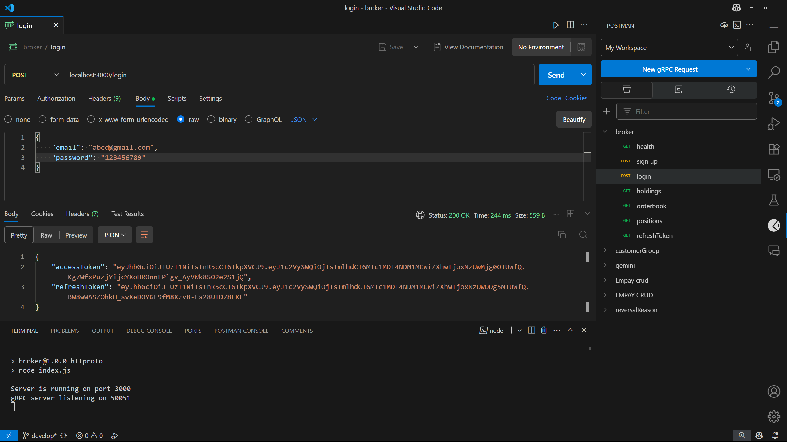
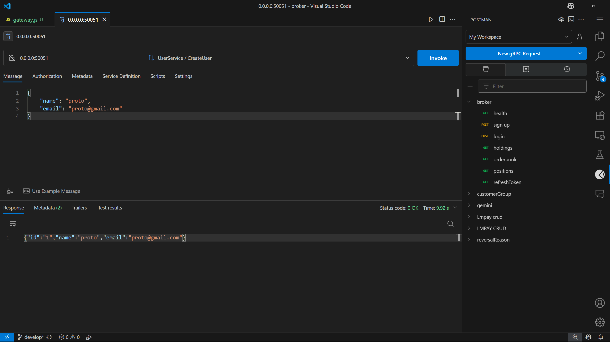

broker (js+psql)

Inspiration: https://github.com/microsoft/TypeScript-Node-Starter (ts+mongo)

prisma config generation: npx prisma generate
prisma table creation/migration: npx prisma migrate dev

NPM RUN HTTPROTO

use postman collection for http calls, protos/user.proto for proto calls

# may the best engineer succeed :)